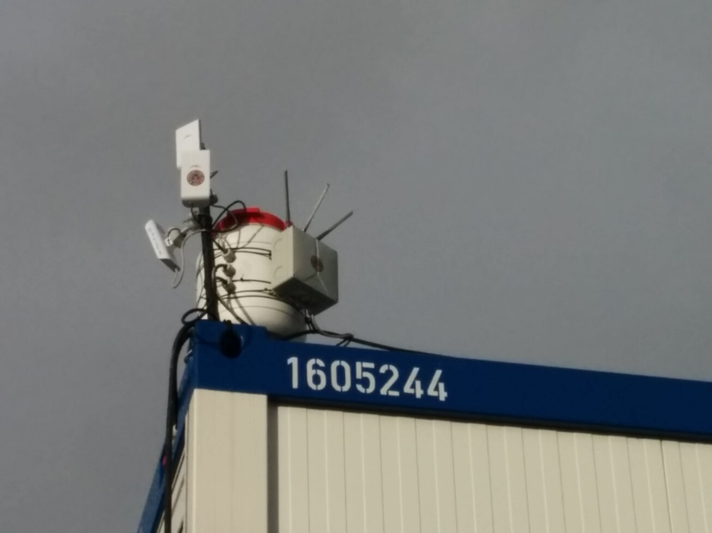

[Freifunk]: https://hamburg.freifunk.net/ "Freifunk Hamburg"
[Gluon]: https://github.com/freifunk-gluon/gluon "GitHub: freifunk-gluon"
[OpenWRT Wiki]: https://wiki.openwrt.org/toh/tp-link/tl-wr841nd#hardware_v9 "OpenWRT: TL-841ND"

## Freifunk explained

> The vision of [Freifunk] is the establishment of free networks, the democratization of communication media and the promotion of local social structures.

Basically, if you want to participate in a Freifunk community, you take a router capable of running OpenWRT and flash it with a special community-flavored version of OpenWRT based on [Gluon]. If there are other Freifunk nodes in reach, your router will mesh with them and connect you to the network. If you have an internet connection you want to share, then connect the WAN port of your router accordingly and become an uplink for other clients.

## Router build

So far, so good .. now, for optimal signal strength, you might want to place your router outside, in front of your window, on your rooftop, you name it .. and this is why I put my TP-Link TL-WR841N into an outdoor case. The following picture is an unrelated but similar installation in a Spelberg A-Box:



I exploited the fact that there is a small DC-DC converter on the router's PCB and power it by passive power-over-ethernet, using one of Ubiquiti's 15V PoE injectors. That way, there is only a single cable coming out of the case. However, that also means that there is no second cable to connect my own devices to the LAN ports. Why would I want that? Well, currently my ISP does not provide me with an IPv6 address ...

## VLAN to the rescue

Luckily, OpenWRT has support for VLAN tagging. This was my first use of virtual networks, so this might not be an optimal approach but hey, it works.

The [OpenWRT Wiki] states for this model (v9): _"eth1 is directly connected to the WAN port."_ Unfortunately, this means there is no easy way to directly configure VLANs on the WAN port using `/etc/config/network` (or none that I know of). I might have reconfigured my WAN interface to be one of the yellow LAN ports, making it part of switch0 .. but instead I simply added a line to my `rc.local`:
```bash
# Put your custom commands here that should be executed once
# the system init finished. By default this file does nothing.

# adds a vlan interface to eth1 (WAN) on vlan id 10 to distribute client network
ip link add link eth1 name vlan10 type vlan id 10

exit 0
```

This adds a VLAN with id 10 on the WAN interface after boot.
Now we need to tell the firmware to include this new interface in the client-network bridge. Your default `/etc/config/network` might look something like this if you are running Freifunk-Gluon:

```bash
[..]

config switch
    option name 'switch0'
    option reset '1'
    option enable_vlan '1'

config switch_vlan
    option device 'switch0'
    option vlan '1'
    option ports '0 1 2 3 4'

config interface 'wan'
    option igmp_snooping '0'
    option ifname 'eth1'
    option auto '1'
    option peerdns '0'
    option type 'bridge'
    option proto 'dhcp'
    option macaddr 'REDACTED'

[..]

config interface 'client'
    option reqprefix 'no'
    option proto 'dhcpv6'
    option type 'bridge'
    option igmp_snooping '0'
    option macaddr 'REDACTED'
    option peerdns '1'
    option ifname 'eth0 bat0'

config interface 'mesh_wan'
    option ifname 'br-wan'
    option mesh 'bat0'
    option proto 'batadv'
    option auto '0'

config interface 'mesh_lan'
    option ifname 'eth0'
    option auto '0'
    option macaddr 'REDACTED'
    option mesh 'bat0'
    option proto 'batadv'

[..]
```

We now simply include the appropriate interface in the client bridge:

```bash
@@ -52,7 +52,7 @@ config interface 'client'
        option igmp_snooping '0'
        option macaddr 'REDACTED'
        option peerdns '1'
-       option ifname 'eth0 bat0'
+       option ifname 'eth0 bat0 vlan10'
```

.. and that's about it. Of course you need to configure your devices to detect and use this new VLAN now but that shall not be the scope of this post.

Just as an example: I recently bought a dual-band access point from Linksys, which supports VLANs and multiple SSIDs natively. My Freifunk network is since extended into the 5GHz spectrum by simply configuring a "hamburg.freifunk.net" SSID on the second radio to use VLAN tag 10 and connecting the AP to the same switch.
