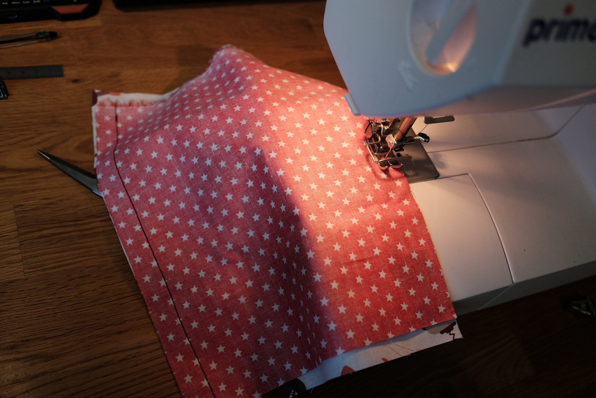
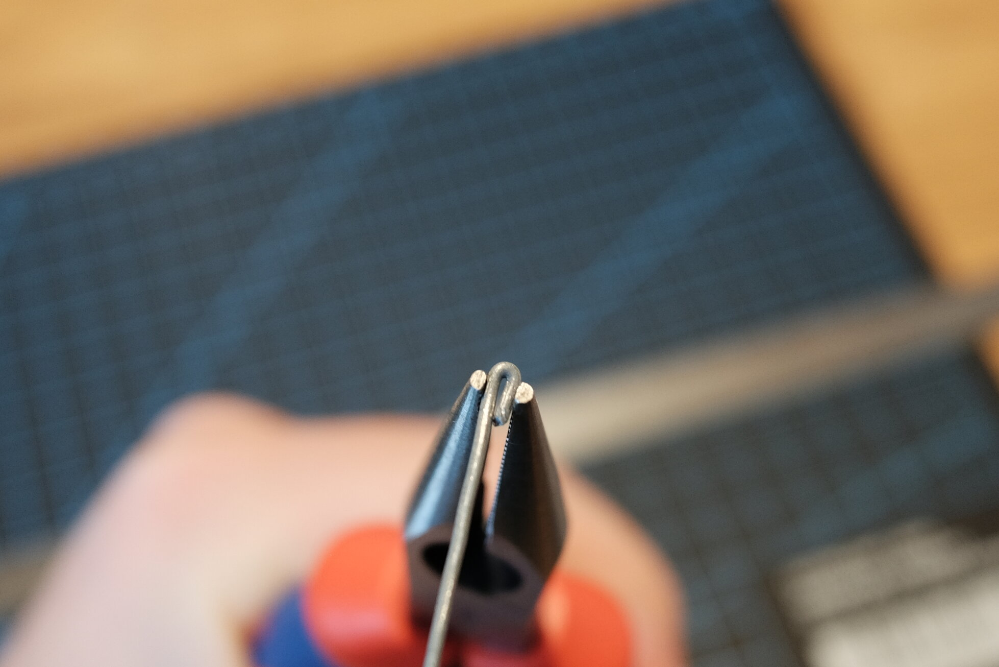
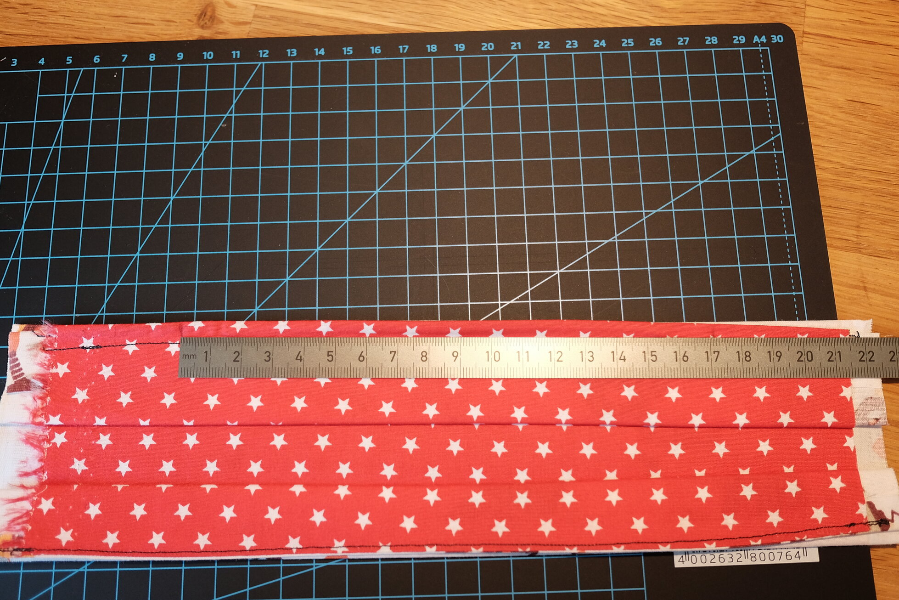
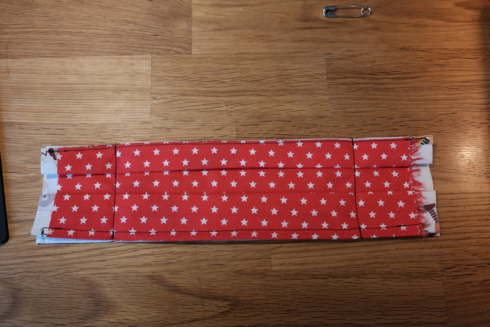
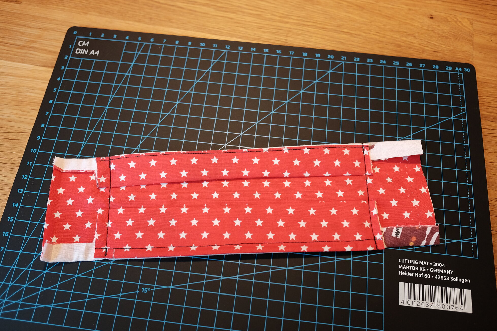
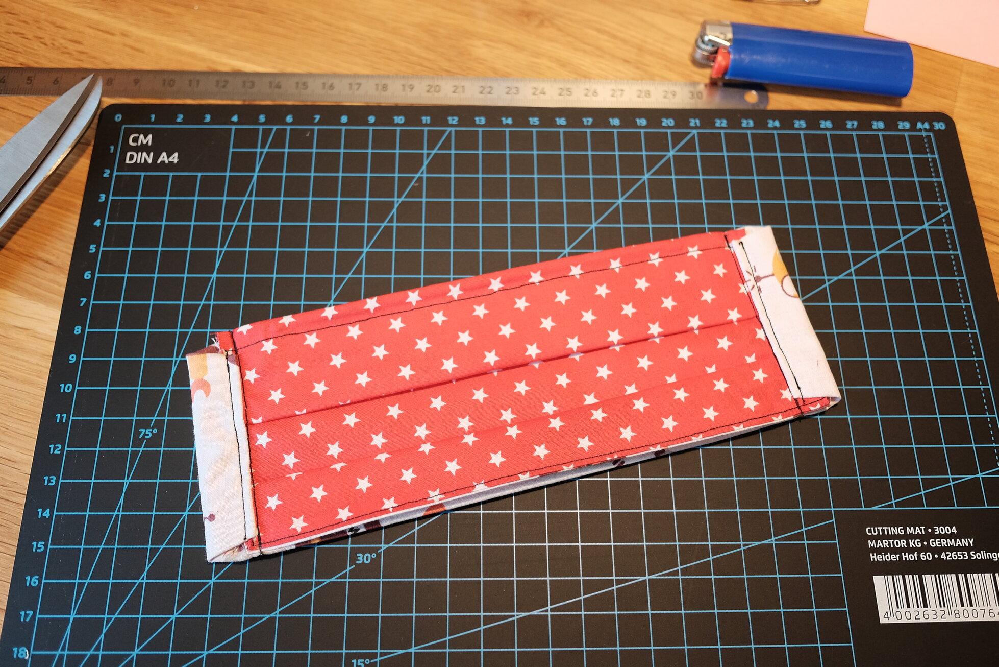
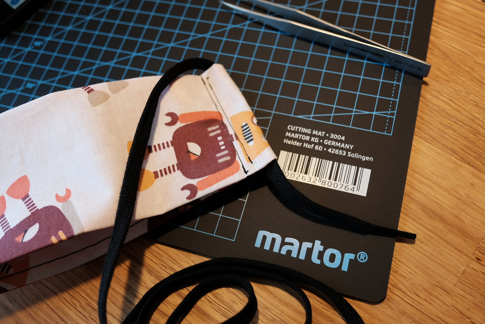

Aktuell verbreitet sich das neuartige Coronavirus (SARS-CoV-2) rasant auf der gesamten Welt mit teils verheerenden Folgen. Dies soll aber kein Beitrag über das Virus an sich sein, sondern eine Anleitung wie ihr euch auch in Zeiten, in denen Mundschutz Mangelware ist und besser dem medizinischen Personal vorbehalten werden sollte, ganz einfach selber eine Behelfslösung nähen könnt.

<!--more-->
## Vorwort

### Haftungsausschluss

Gleich vorneweg: die hier vorgestellte Mundbedeckung ist **keine** Schutzmaske! Ich übernehme **keinerlei Haftung** für die Wirksamkeit, die Herstellung oder die sachgerechte Verwendung dieser Mundbedeckung. Das sollte eigentlich klar sein, aber dies ist **kein** Ersatz für eine zertifizierte FFP2 oder FFP3 Maske, die korrekt sitzt. Die Herstellung und Verwendung geschieht daher ausschließlich auf eigene Gefahr.

An dieser Stelle sei auch auf die [Hygienehinweise des RKI](https://www.infektionsschutz.de/coronavirus/) hingewiesen. **Wascht euch die Hände.** **Haltet Abstand.** Dadurch schützt ihr euch im Zweifel sehr viel effektiver.

### Prior Art

Ich bin natürlich nicht der erste, der auf diese Idee kommt. So gibt es zum Beispiel bereits eine schöne [Anleitung von der Stadt Essen](https://www.essen.de/gesundheit/coronavirus_6.de.html) ([PDF](https://media.essen.de/media/wwwessende/aemter/0115_1/pressereferat/Mund-Nasen-Schutz__Naehanleitung_2020_Feuerwehr_Essen.pdf)) und einen [Aufruf von Maskierte Helfer](https://www.maskierte-helfer.de/) Masken nach eben dieser Anleitung herzustellen und anderen Menschen zur Verfügung zu stellen. Wenn ihr Kapazitäten habt überschüssige Masken herzustellen, meldet euch bei denen!

Die ersten Masken habe ich auch nach dieser Anleitung hergestellt. Jedoch fand ich als Amateur an der Nähmaschine einige Stellen relativ knifflig. So fiel mir zum Beispiel das Zuschneiden der dünnen Streifen und das Umsäumen der Ränder nicht besonders leicht. Und auch nach einigen Versuchen mit Gummibändern in verschiedenen Variationen wollte mir das Ergebnis nicht so recht gefallen.

Heute morgen stieß ich dann auf [ein Bild](https://imgur.com/dbbIJqy), in dem die Maske eine etwas andere Form hat und ich beschloss nochmal einen etwas anderen Schnitt auszuprobieren. Dabei erreiche ich durch Umstülpen saubere Kanten ohne diese extra umsäumen zu müssen, kann trotzdem einen Draht für die Passform einlegen und habe durch die seitlichen Schlaufen freie Wahl, wie ich die Maske befestige. Vor allem aber brauche ich dazu nur zwei rechteckige Zuschnitte! Dies ist das Ergebnis.

### Wirksamkeit

Wie eingangs erwähnt kann eine Maske aus Stoff auf garkeinen Fall eine dicht abschließende FFP2 oder FFP3 Maske ersetzen. Auch im Vergleich zu einfacheren OP-Masken erreicht Baumwollstoff nur einen *Bruchteil* der Filterleistung. Ihr helft mit so einer Maske vor allem andere Menschen und *nicht euch selbst*. Aber auch eine einfache Maske ist besser als gar keine Maske. Lasst nur kein falsches Sicherheitsgefühl aufkommen und denkt trotzdem daran euch die Hände zu waschen. Behandelt vor allem auch die Außenseite der Maske nach dem Tragen als kontaminierte Oberfläche!

Einige Wissenschaftler der Cambridge Universität haben die Effektivität verschiedener Stoffe für DIY Masken untersucht und sind zu dem Schluss gekommen, dass 100% Baumwollstoff und antimikrobielle Kissenbezüge am besten geeignet sind:

* [Testing the Efficacy
of Homemade Masks: Would They Protect in an Influenza Pandemic? Disaster Medicine and Public Health
Preparedness, Available on CJO 2013 doi:10.1017/dmp.2013.43](https://www.researchgate.net/publication/258525804_Testing_the_Efficacy_of_Homemade_Masks_Would_They_Protect_in_an_Influenza_Pandemic)
* [What Are The Best Materials for Making DIY Masks?](https://smartairfilters.com/en/blog/best-materials-make-diy-face-mask-virus/)

Die Masken sollten nach der Verwendung gereinigt werden. Am besten wirft man sie dazu in eine Kochwäsche bei 95°C oder kocht sie einige Minuten direkt auf dem Herd in einem Topf mit Wasser. Aus diesem Grund sollten auch alle Materialien, die ihr verwendet, für Kochwäsche geeignet sein.

Für ein kleines bisschen extra Filterleistung könnt ihr euch auch eine Öffnung in der Maske offen lassen, durch die ihr dann eine zusätzliche Schicht Mikrofaser-Stoff oder getrocknete feuchte Toilettenpapier-Tücher steckt. Diese sollten als Einweg-Filter behandelt werden und nach jeder Verwendung entsorgt werden:

* [Taiwanese doctor shares how to make DIY cloth face mask complete with non-woven fabric air filter](https://mothership.sg/2020/02/taiwanese-doctor-cloth-face-mask/)

## Anleitung

Zunächst braucht ihr zwei rechteckige Stoffzuschnitte von etwa **20 x 25 cm**. Also jeweils etwas kürzer als eine A4 Seite.

Diese legt ihr rechts auf rechts aufeinander und näht die **langen Kanten** zusammen. An der Oberkante lasst ihr dabei etwas mehr Platz, um im nächsten Schritt einen Draht einlegen zu können. Anschließend stülpt ihr den entstandenen Schlauch einmal um. Das Internet sagt, das heißt Verstürzen.

Der Draht sollte eine Länge von ca. **15 cm** und eine Dicke von **1 mm** haben. Dünnerer Gartendraht geht auch, hält aber die Form nicht so gut. Mit einer Spitzzange biegt ihr die Spitzen um und drückt diese flach, damit sie nicht durch den Stoff stechen können.

Den so vorbereiteten Draht legt ihr auf der Innenseite des Schlauchs zwischen die Stoffränder der Oberkante, die im letzten Schritt entstanden sind. Drückt den Draht möglichst weit in den Rand hinein und steppt die Kante dann einmal ab, damit der Draht dort eingeschlossen wird.

Gebt dem Stoff nun einige Falten. Diese werden später in der fertigen Maske aufgezogen um eine Muschelartige Form entstehen zu lassen, die sich besser um den Kopf legt.

Hier im Bild habe ich nur zwei größere Falten oben und unten benutzt. Die drei Falten aus der Anleitung der Stadt Essen funktionieren aber besser! Sie ergeben nacher eine bessere Rundung der Maske.

In diesem Schritt wird die gefaltete Maske nun an den Seiten zugenäht. Wichtig ist dabei, dass zwischen den Nähten ungefähr **17 cm** liegen. Je nach Kopfumfang könnt ihr das natürlich etwas variieren.

Vor dem nächsten Schritt habe ich in den gefalteten Ecken ein wenig Material weggeschnitten, um es meiner Nähmaschine etwas leichter zu machen. Die seitlichen Enden werden auf **4 cm** eingekürzt und dann eingefaltet um eine Art Schlaufe entstehen zu lassen und dabei eine saubere Kante zu erzeugen. Diese steppt ihr dann so nah ihr könnt ab.

Und damit ist die Maske auch schon fast **fertig**! In die seitlichen Schlaufen könnt ihr nun Bänder zum Befestigen einfädeln -- hier habe ich zum Beispiel unbenutzte Schnürsenkel verwendet. Die Vorderseite wird dann auseinandergezogen um die Falten zu öffnen und mit dem Draht in der Oberkante biegt ihr euch die Passform um die Nase zurecht, damit die Maske möglichst dicht abschließt.

Am Ende sieht das Ganze dann ungefähr so aus:

Viel Spaß beim Nähen und bleibt gesund!
