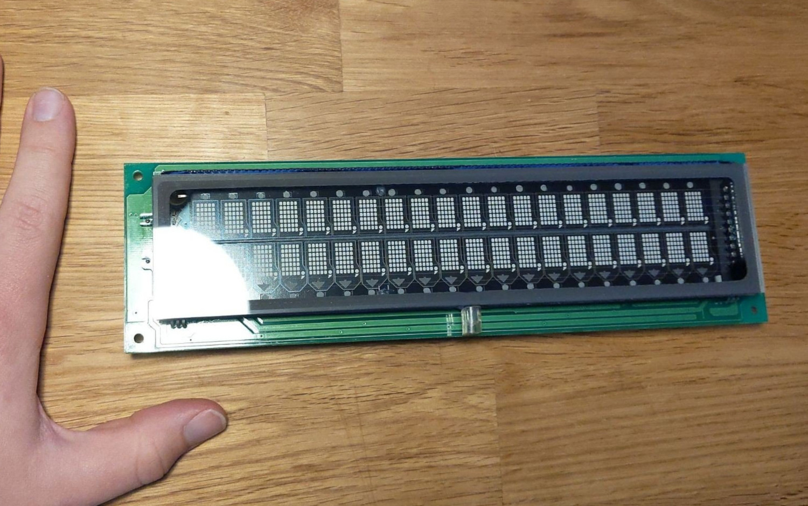
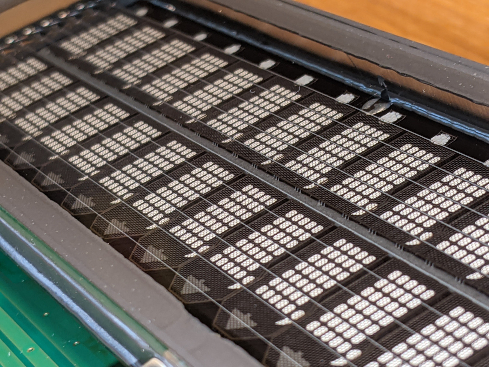
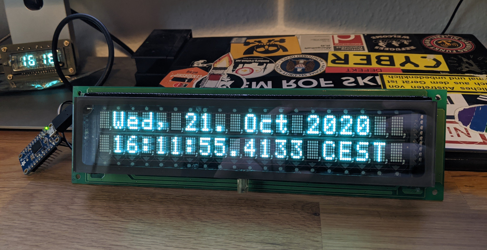

[datasheet]: Noritake-Itron_CU200211SCPB-T60A-05.pdf

After finishing my own [VFD clock project](https://github.com/ansemjo/chronovfd)
a while ago, I now bought a ready-made module from Noritake Itron because I
wanted to take a look how they do it -- especially the filament supply.

These modules usually sell for somewhere above 50€. But here I found one on
eBay for just over 20€. The description had no model number or dimensions but
I didn't care much .. I bought it. Well, what should I say .. this module is **huge**:



And look at these beautiful segments and grids!



According to the PCB date under the display, this thing is older than me.
Here's a shot of the backside:

[](backside.jpg)

It is a `CU200211SCPB-T60A` from ISE Electronics Corp. Japan / Noritake Itron Corp. and it
has two rows of 20 characters, where each is a small 5x7 dot matrix -- display refresh driver
and interface logic is all on-board. It may look a little daunting at first but three wires
is all you need to put text on the display: `GND`, `VCC` and a serial `TX`. These pins are
available on both `CN1` and `CN2`. Be aware that the datasheet lists the power supply current
at 5V as 1100 mA; if you plan to power the entire display through a serial adapter make sure
your USB port can handle this current. Connector pinouts, special instructions and the
character font table can be found in the [single-page datasheet][datasheet].

The first thing is to make sure that the serial port is configured correctly. Take a look at
the solder jumpers `J0..4` next to `CN1`: if they're all left open then you need 19200 baud,
8 databits and even parity. To get going quickly I used this `picocom` command:

```
picocom --baud 19200 --flow none --parity even /dev/ttyUSB0
```

You can start typing right away and the display will write it out in its beautiful
blue-green-ish glow.


To send hexadecimal commands directly from picocom use <kbd>C-a</kbd> <kbd>C-w</kbd>.  
For example clearing the display:

```
<C-a C-w>
*** hex: 0E<Enter>
*** wrote 1 bytes ***
```


After a few minutes of experimenting with the instructions I cobbled together a quick
date and time display -- *what else*?

```sh
#!/usr/bin/env bash

# setup serial line
PORT="${PORT:-/dev/ttyUSB0}"
picocom --quiet --baud 19200 --parity even --flow none --databits 8 --noreset --exit "$PORT"

# software reset for clean slate
echo -ne '\x1b\x49' >"$PORT"
sleep 0.5

# apply settings
echo -ne '\x1b\x4c\xff' >"$PORT" # full brightness
echo -ne '\x16'         >"$PORT" # disable cursor

while true; do

  # reset position and print date line: "Wed, 21. Oct 2020"
  printf '\x0c %s' "$(date '+%a, %d. %b %+4Y')" >"$PORT"

  # line feed and print wall clock: "16:11:55.4133 CEST"
  printf '\x0c\x0a %s.%.4s %s' $(date '+%T %N %Z') >"$PORT"

done
```





The second script I wrote displays the total / used / free RAM in MiB:

```sh
#!/usr/bin/env bash

# setup serial line
PORT="${PORT:-/dev/ttyUSB0}"
picocom --quiet --baud 19200 --parity even --flow none --databits 8 --noreset --exit "$PORT"

# software reset for clean slate
echo -ne '\x1b\x49' >"$PORT"
sleep 0.5

# apply settings
echo -ne '\x1b\x4c\xff' >"$PORT" # full brightness
echo -ne '\x16'         >"$PORT" # disable cursor

while true; do

  # reset position and print labels
  printf '\x0c%s' "RAM: total used free" >"$PORT"

  # print current memory usage
  cnt=1000
  until [[ $cnt -le 0 ]]; do
    printf '\x0c\x0aMiB  %5.5s %4.4s %4.4s' $(free --mebi | awk '/^Mem:/ { print $2, $3, $4 }') >"$PORT"
    let cnt-=1
    sleep 1
  done
  
done
```


Wasn't this simple? Note that there is a "Flickerless Write" instruction in the datasheet but
I haven't figured out how to use it yet.

To be fair, I haven't looked at the hardware much yet either. But this concludes my initial
exploration of the serial interface of this Noritake VFD for now.
