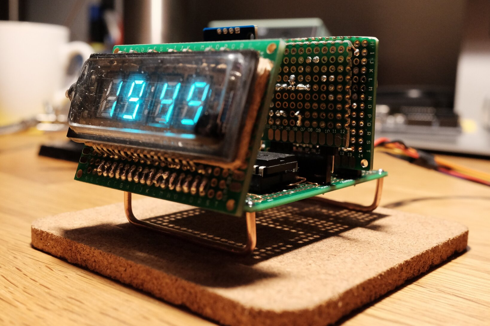

Vacuum flourescent displays are a beautiful piece of retro technology. Noritake Itron
and a few others still build them as dot-matrix or full graphic displays. But the
technology dates back to the 70's and you can find some surplus units available on eBay.

<!--more-->

That's how eight [ИВЛ2-7/5](ebay-search) displays came into my posession. The plan is to
build a simple clock out of them and in the process learn more about bare ATmega programming,
electrical circuit design and PCB layouting -- in the end I would like to order my first
batch of manufactured PCBs and place the parts myself.

[ebay-search]: https://www.ebay.com/sch/i.html?_nkw=ivl2-7%2F5 "Search on eBay.com"

## Overview

In the picture above you can see one of the displays soldered on some protoboard and connected
to a makeshift power supply on a breadboard. I can't control the digits and segments individually
yet but at least I can see it's working and I can enjoy its blue-ish glow. :)

Some basic technical details for anyone wanting to play with these particular units:

    Filament Voltage:       2.4  V~
    Filament Current:        65  mA
    Anode / Grid Voltage:  24.0  V

The filament is connected at the outermost pins. The rest are connected to the digit grids
and segments. Filament and grid pins are also duplicated on the other side (the one with fewer
pins). Through the glass construction you can easily see how the segments are connected, even
without a datasheet.

## Prior Art

Before I first connected the display to anything I studied lots of previous articles and projects
on VFD tubes. There's a few very beautiful examples where people built wristwatches with these displays!

Here's a list of interesting and educational links:

* [JohnEngineer's ChronodeVFD](https://archive.is/ODOFR): a steampunk-esque wristwatch powered from a single 1.5V Alkaline battery ([flickr](https://www.flickr.com/photos/johngineer/15564850491/), [archive](https://archive.is/ODOFR))

* [VFD Watch Demystified](https://www.instructables.com/id/Vacuum-Fluorescent-Display-Watch/): a clone of the wristwatch above, driven by an ESP32, complete with schematics and code ([archive](https://archive.is/ojaD5))

* [VFD Clock](http://vwlowen.co.uk/arduino/vfd/vfd-clock.htm): a desk clock design, where the filament is driven from a regulated H-bridge ([archive](https://archive.is/Xkr9G))

* [Tiny IV-21 VFD Clock](https://hackaday.io/project/167749-tiny-iv-21-vfd-clock#j-discussions-title) uses a hovering actual tube VFD where the filament is powered directly with a voltage divider through a transistor

* [Yet another clock design](http://kevinrye.net/index_files/vfd_clock_part3.php) by Kevin Rye ([archive](https://archive.is/C2UBq))

* [Noritake Itron VFD operation guide](https://www.noritake-elec.com/technology/general-technical-information/vfd-operation): contains extensive descriptions of how to drive the filament with center-tapped AC couplings ([archive](https://archive.is/BsdLR))

* [A series of posts on idyl.io](https://idyl.io/category/vfd/) follows the design of VFD quasi-dot-matrix displays with several different PSU designs based on OpAmps and H-bridges

* [EEVBlog user Rolo designs a universal VFD PSU](https://www.eevblog.com/forum/projects/showing-my-vfd-psu/) based on an LM4871 OpAmp ([archive, no images](https://archive.is/bkgaG))

## Filament AC Voltage

As you can see from the links above, one of the most controversial aspects of hobbyist builds with
these displays is the power supply for the filament. Per the Noritake Itron operational guide
it requires a relatively low-voltage **alternating** current, which is hard to come by if your
project is not powered from mains through a transformer.

The reason for that is that you'll have a luminousity gradient if the filament is driven by DC.
One end will have a greater potential difference to the anodes and thus be a little brighter.

Especially in the wristwatch designs you see the filament is just being driven with DC voltage
since the effect diminishes with lower filament voltage and the required power supply is not trivial
otherwise -- space and efficiency constraints apply.

To see for myself how bad this effect was I used two pairs of GPIO pins on an Arduino UNO to drive the
filament with pulse-width modulated *simulated* AC: one pair is driven `HIGH` while the other is set `LOW`,
after a short microsecond delay the direction is switched and some dead time is added to reduce the
effective output voltage. This approach was detailed in one of the previous builds. Two pairs are used
in order to stay within the ATmega328P's maximum current specifications per pin.

<video controls loop autoplay muted style="width: 100%;">
  <source src="filament_ac.mp4" type="video/mp4">
</video>

The camera exaggerates the effect a little bit but it definately *is* noticeable! So I think I want
to implement some form of AC drive after all ..

I am currently waiting for a large-ish order from DigiKey with enough parts to properly
multiplex the individual digits and segments. I will attempt to reproduce Rolo's power supply
for the filament, which is based on a self-oscillating audio amplifier circuit.

Let's see how that goes. :)

## Updates

Update: so that went pretty well!

Using the display unit you see in the experiments above, I first built a working prototype
clock completely on protoboard using enamelled wires for connections. It used a DIP variant
of the HV5812 display driver and an ATtiny84. There's a few more pictures
[on my Twitter](https://twitter.com/ansemjo/status/1235315817937596424).

During these last months I then picked up more and more circuit board design in KiCad. After
creating a few smaller projects I designed a sandwiched construction with two seperate boards
for the *display driver* and the logic unit -- the *clock core*.

There was a lot to be learned in this project and I am very happy with the results, even if it
is just another clock. :)

You can find the entire project on GitHub in [ansemjo/chronovfd](https://github.com/ansemjo/chronovfd/).

