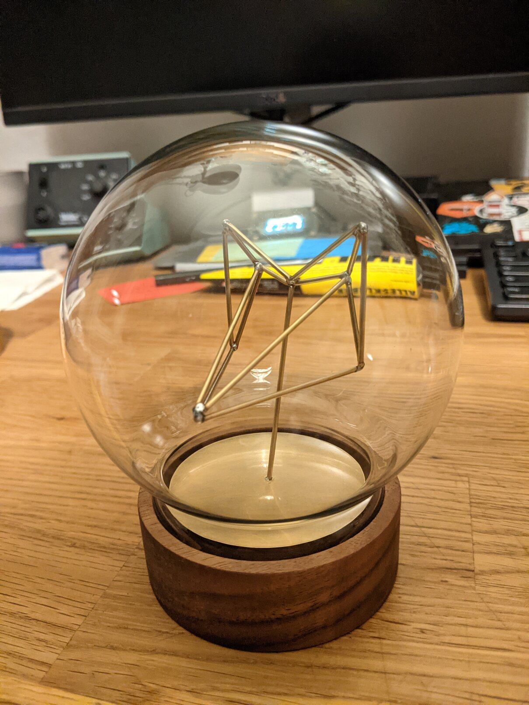
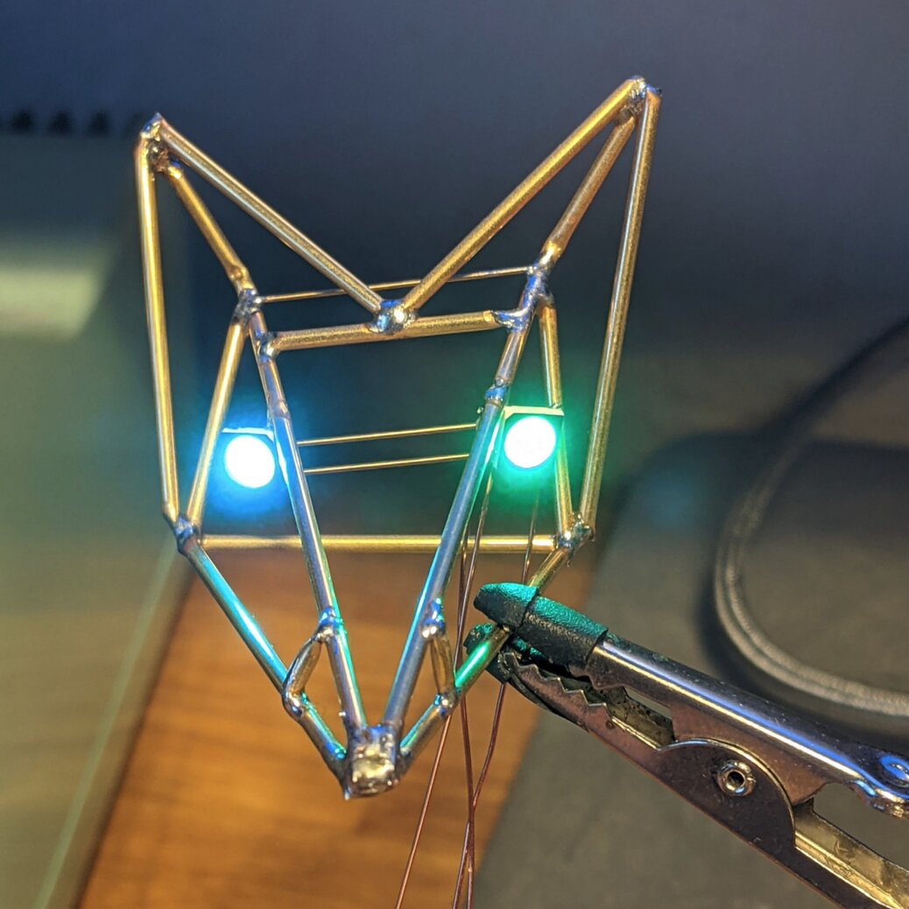
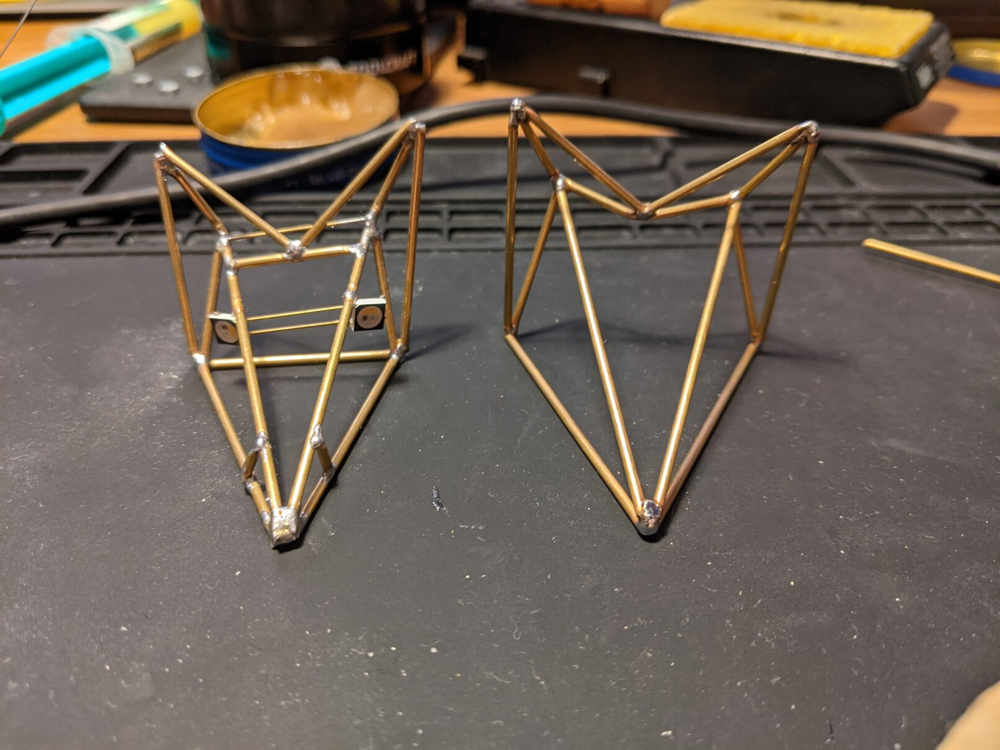
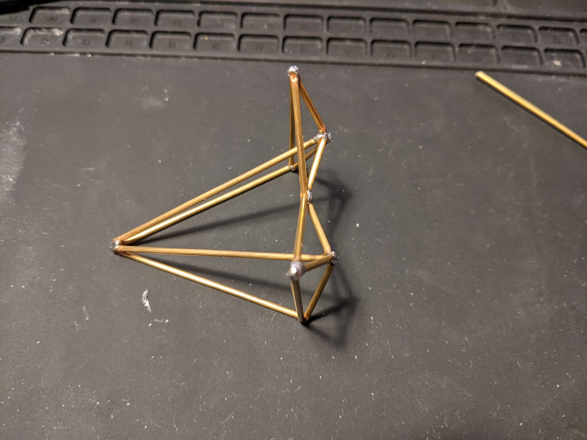
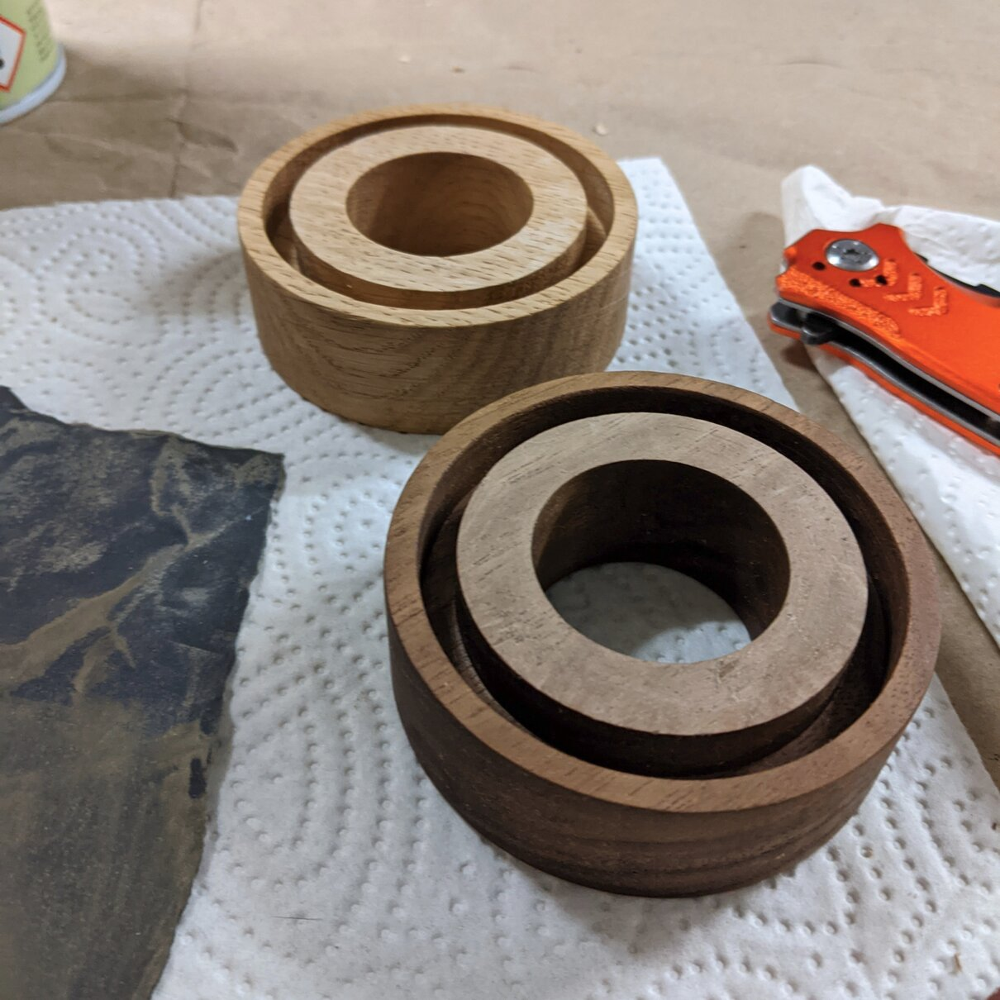
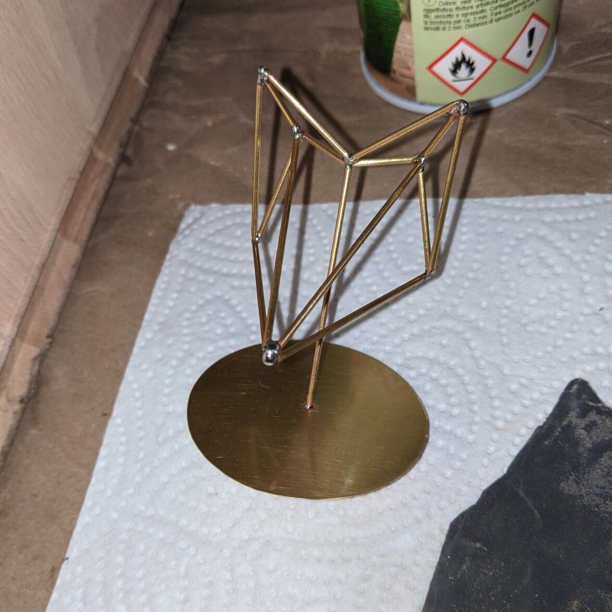

This is just a simple post about some artwork I did as a present recently.
I wanted to try my hand at freeforming solder-art, so I got some brass rods and
tried to form a foxes head.

<!--more-->

This was the result:

My initial idea involved some NeoPixel-style RGBW LEDs for the eyes. But
the first figure was so skewed, that I wasn't really happy with the result
-- even though the eyes worked as intended.

Second time was the charm in this case. Simplified the polygons a little bit
and adjusted the proportions:

I bought [a small glass dome at idee](https://www.idee-shop.com/made-by-me-glasdekohaube-mit-sockel-10x12-5cm)
and my roommate was nice enough to mill me a replacement base from a piece of
walnut wood because the MDF base looked terrible.

The head was soldered onto a piece of solid rod, that in turn was soldered
into a small hole in a thin brass plate. The figurine was coated with some
clear-coat and the wood was oiled. I was clumsy and needed to grind down the
upper surface a little bit afterwards, so I could later glue the brass plate
in place.

And finally, I'll just repeat the end result here. In case you wonder,
the title is a reference to [a song by Beginner](https://www.youtube.com/watch?v=gq7LGp5HNIU).

