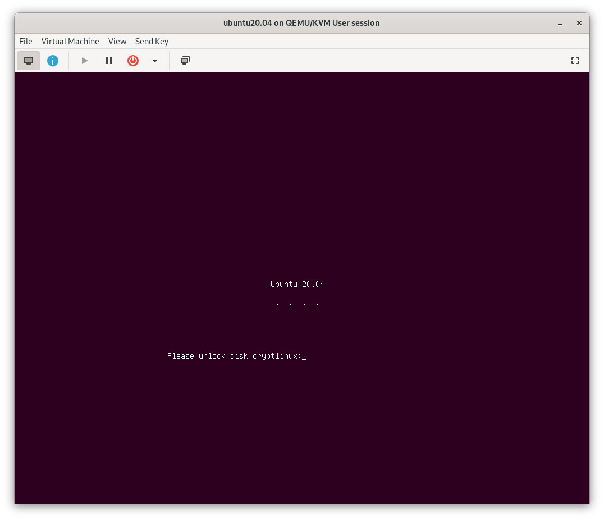

I dislike the new Ubuntu installer, `subiquity`.

Apparently I wanted to do something that was not supported by this new installer (yes, I know there's an encrypted LVM variant but I didn't want LVM). And even when I installed the minimal possible package selection, I found myself writing a [cleanup script](https://gist.github.com/ansemjo/89fbaf1e58f79673b45a488ca098d3ae) just to remove unwanted packages afterwards.

There may be another guide coming soon on how to *convert* an existing Ubuntu Server installation into a fully encrypted one, which unlocks automatically on boot through network-bound disk encryption. However, this is a guide on installing a custom Ubuntu server with an encrypted root on a UEFI system using `debootstrap` -- the "hard" way.

In writing this, I was partly following these two guides:

* [shinycore/debootstrap-focal-plasma.md](https://gist.github.com/shinycore/d02f3968e02b7f548c68c039277912aa)
* [the-empire.systems/minimal-ubuntu-install](https://the-empire.systems/minimal-ubuntu-install)


## Boot into a Setup Environment

Either the boot the Desktop or Server ISO. The Desktop variant may be easier to use but is not really necessary. On a Server installation click through the language and network settings, then select `[Help]` in the top bar and then `Enter Shell`.

I suspect that you can perform these steps from a Debian image, too; you'll just need to specify the correct mirrors in that case. Even Arch Linux has a `debootstrap` package in its community repository, so ...


When following along in a virtual machine, make sure to customize the machine before installation and select an UEFI loader. You can also edit an existing machine XML later by adding a `loader` element:

```xml
<os>
  <type arch="x86_64" machine="pc-q35-6.1">hvm</type>
  <loader readonly="yes" type="pflash">/usr/share/edk2-ovmf/x64/OVMF_CODE.fd</loader>
</os>
```

Note that I did not specify an `nvram` element -- it appears that `virt-manager` adds one automatically on next boot.


## Install Tools

Make sure the `universe` repository is enabled and then install necessary tools:

```sh
add-apt-repository universe
apt update && apt install -y debootstrap arch-install-scripts
```

## Partitioning

I will be rather brief in this part because I assume you know how you want to partition your disk if you're following this guide. For this example I used two partitions: one small EFI system partition and an encrypted Linux partition.

```
gdisk /dev/vda
n 1 (default) +512M ef00  # EFI system partition
n 2 (default) -256M 8300  # Linux partition
w
```

Next create the filesystems:

```sh
mkfs.vfat -F32 -n esp /dev/vda1
cryptsetup luksFormat --label cryptlinux /dev/vda2
cryptsetup open /dev/vda2 cryptlinux
mkfs.ext4 -L linux /dev/mapper/cryptlinux
```

And mount everything in place under `/mnt`:

```sh
mount /dev/mapper/cryptlinux /mnt
mkdir -p /mnt/boot/efi
mount /dev/vda1 /mnt/boot/efi
```

You may want to add a swap file. I'd recommend not using a separate swap partition for encrypted systems.

```
dd if=/dev/zero of=/mnt/swapfile bs=1M count=512
mkswap /mnt/swapfile
chmod 600 /mnt/swapfile
swapon /mnt/swapfile
```

## Bootstrap

In its simplest form `debootstrap` only requires the suite (`focal` for Ubuntu 20.04) and target directory. But you can also specify the architecture and use a different mirror, which is faster or closer to you. Note that the mirror you use will also be written to `/mnt/etc/apt/sources.list`, so it should be a stable one. 

```sh
debootstrap focal /mnt https://mirror.leaseweb.com/ubuntu/
```

Create a new mounting table for your installation:

```
genfstab -U /mnt >> /mnt/etc/fstab
```


Don't forget to also add an entry to `/mnt/etc/crypttab` for your encrypted root partition. Otherwise `cryptsetup-initramfs` will not be able to setup your root partition for unlocking during boot. The name should match what you used during partitioning above.

```
printf 'cryptlinux UUID=%s none luks\n' >>/mnt/etc/crypttab \
  $(blkid -o value /dev/vda2 | head -1)
```



## apt Preparations

Before we install anything else, I'd like to make sure that some packages are never considered. Since this is an UEFI system and I'll be using `systemd-boot` I don't need any GRUB packages. Furthermore I would like to avoid installing any of the cloud-centric packages or remote management tools that come with Ubuntu by default. So create the following file in `/mnt/etc/apt/preferences.d/ignored-packages`:

```
Package: grub-common grub2-common grub-pc grub-pc-bin grub-gfxpayload-lists
Pin: release *
Pin-Priority: -1

Package: snapd cloud-init landscape-common popularity-contest ubuntu-advantage-tools
Pin: release *
Pin-Priority: -1
```

Next, edit `/mnt/etc/apt/sources.list` to add `-security` and `-updates` suites and enable the `restricted` and `universe` repositories:

```
deb https://mirror.leaseweb.com/ubuntu focal           main restricted universe
deb https://mirror.leaseweb.com/ubuntu focal-security  main restricted universe
deb https://mirror.leaseweb.com/ubuntu focal-updates   main restricted universe
```

Enter the new installation for the rest of the steps. If you don't use `arch-chroot`, you'll need to bind-mount `/mnt/dev`, `/mnt/proc` and `/mnt/sys` from your running system.

````sh
arch-chroot /mnt
````

## Configure

First update and add a few more necessary packages:

```sh
apt update && apt upgrade -y
apt install -y --no-install-recommends \
  linux-{,image-,headers-}generic linux-firmware \
  initramfs-tools cryptsetup{,-initramfs} efibootmgr
```

Optionally install some additional useful packages. I like to add the following explicitly:

```sh
apt install -y bash vim git tmux
```

Now you can configure a few things like timezone, locales and keyboard settings:

```sh
dpkg-reconfigure tzdata
dpkg-reconfigure locales
dpkg-reconfigure keyboard-configuration
```

Set a hostname in `/etc/hostname` and add a localhost mapping in `/etc/hosts`:

```sh
echo "thehostname" > /etc/hostname
echo "127.0.1.1 thehostname" >> /etc/hosts
```

Set a root password and optionally add another unprivileged user:

```sh
passwd
adduser mustermann
usermod -a -G sudo mustermann
```

Configure your network. There's so many choices here that I won't go into much detail either. But if you have a very simple setup with a single ethernet cable, you can just `systemctl enable systemd-networkd` and add a configuration in `/etc/systemd/network/ethernet.network`:

```cfg
[Match]
Name=enp1s0

[Network]
DHCP=yes
```

## Install your flavour

At this point you can install whatever additional packages or desktop flavour you like. For example, `ubuntu-server` pulls in a lot of useful packages:

```sh
apt install -y ubuntu-server
```

If you would rather have a smaller installation, check [its dependencies](https://packages.ubuntu.com/focal/ubuntu-server) and pick only a subset of those packages, e.g.:

```sh
apt install -y at curl dmidecode firewalld gawk git htop man \
  openssh-server patch software-properties-common tmux vim zstd
```

## Bootloader

Install `systemd-boot` to your ESP:

```sh
bootctl install
```

Then copy the latest kernel and initramfs to the ESP:

```sh
cp --dereference /boot/{vmlinuz,initrd.img,efi/}
```

You'll want to do that every time you update your kernel or something recreates your initramfs – ideally automatically with a hook. One of the guides suggests a script in `/etc/kernel/postinst.d/` but in my quick tests that did not work reliably. So I wrote a small script in `/boot/copykernels` to be called by an APT hook:

```bash
#!/usr/bin/env bash
# copy updated kernel and initrd to efi system partition

b=/boot
e=/boot/efi

# kernels: check versions
for kern in vmlinuz{,.old}; do
  if [[ $(file -Lb $b/$kern 2>/dev/null) != $(file -b $e/$kern 2>/dev/null) ]]; then
    cp -fv --preserve $b/$kern $e/$kern
  fi
done

# initrd: check creation time
for init in initrd.img{,.old}; do
  if [[ $b/$init -nt $e/$init ]]; then
    cp -fv --preserve=mode,ownership $b/$init $e/$init
  fi
done
```

Write the following line to `/etc/apt/apt.conf.d/99-copykernels` in order to call this hook after every upgrade etc.:

```
DPkg::Post-Invoke { "/boot/copykernels"; }
```

Finally, add a simple loader entry in `/boot/efi/loader/entries/ubuntu.conf`:

```cfg
title   Ubuntu
linux   /vmlinuz
initrd  /initrd.img
options root=/dev/mapper/cryptlinux
```

If you want a pretty splash screen that asks for your LUKS password add `splash` to the options and install `plymouth` (plus a theme if you want to).


Again, without going into much further detail, you might want to check [ansemjo/sbkernelsign](https://github.com/ansemjo/sbkernelsign) or [andreyv/sbupdate](https://github.com/andreyv/sbupdate) to bundle and sign kernel and initramfs as a unit and make use of Secure Boot with your own keys.


## Reboot

Feeling lucky? Exit the chroot, unmount everything and reboot!


