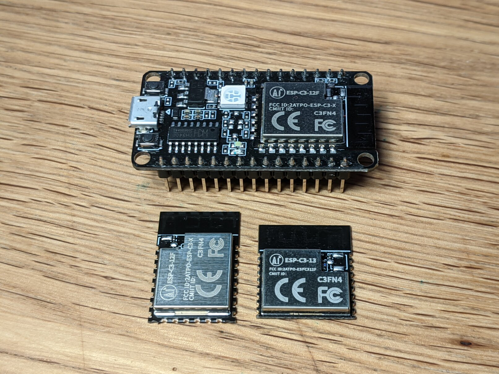
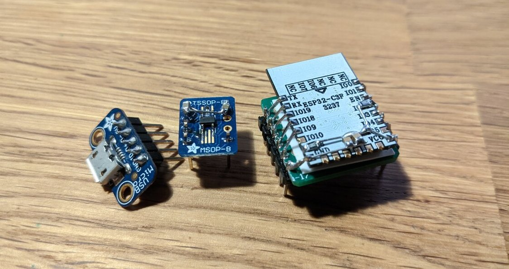
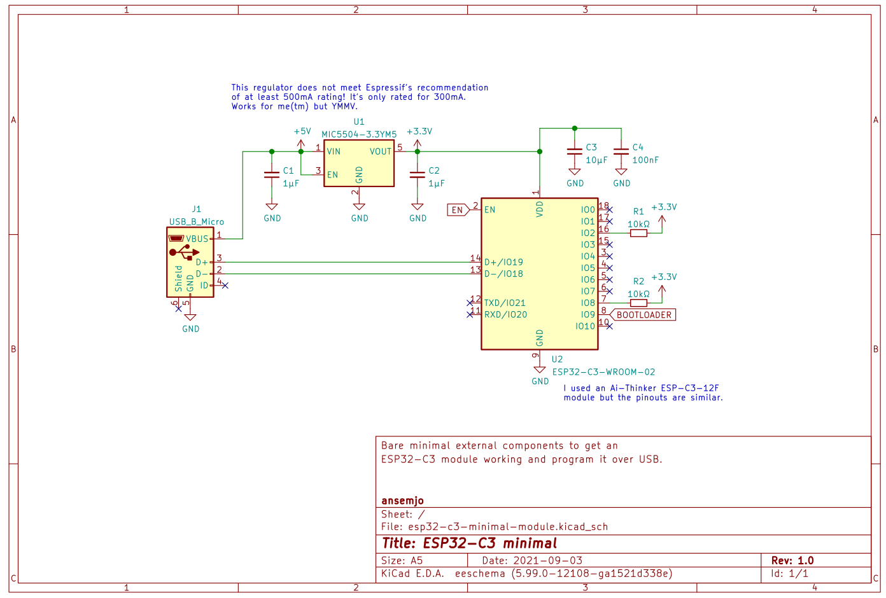

There was a [Hackaday article](https://hackaday.com/2021/02/08/hands-on-the-risc-v-esp32-c3-will-be-your-new-esp8266/) in February titled "The RISC-V ESP32-C3 will be your new ESP8266". Well, after being frustrated with the small memory on an ESP8266 board just recently, I was eager to try this new part. So I ordered some modules and a development board by Ai-Thinker from Aliexpress.

## Modules



What I liked most about this part on first sight was the fact that it has builtin USB, like its bigger sibling the ESP32-S2! That is not a fully-featured and reporgrammable endpoint but it provides a serial console and JTAG connection – enough to program and debug your chip without an external USB-to-Serial chip! There's lots more to like, of course: it's a RISC-V part and includes both WiFi and Bluetooth.

## Wiring it up

After verifying the USB on `IO18` and `IO19` does indeed work on the development board, I set out to find the smallest external circuit for a module which gets me to a console. Behold! The perfboard-trio:



The ESP32-C3 module is glued to the board upside-down and connected to the headers with short pieces of wire. The regulator is a SOT-23-5 part and doesn't really fit onto the TSSOP-8 footprint either .. but it works out. Some capacitors and pull-ups are added for good measure.

The first attempts to wire this up on a breadboard were frustrating though as the chip was continuously resetting due to brownouts. I tried different external regulators and even connected it to the 3.3V pin of the development board; but no luck. It appears the connections themselves on the breadboard were insufficient. As soon as I used simple Dupont jumper cables the brownouts were gone!

## Schematic

This is an equivalent schematic of my wiring:



Download schematic: [PDF](esp32-c3-minimal-module.pdf) [KiCad](esp32-c3-minimal-module.kicad_sch)

Note that this specific regulator may be a little undersized, as it is only rated for 300mA, while Espressif recommends at least 500mA. Also the pull-ups may not actually be necessary; at least `IO8` is [pulled-up within the module](https://docs.ai-thinker.com/_media/esp32/docs/esp-c3-12f_specification.pdf) anyway. But as I noted above, the chip now boots with this exact configuration and it handled some testing with WiFi scanning fine so far.

In a real application you would have some peripherals, of course. And you should also include some input filtering and ESD protection on the USB receptacle. It's still nice that you can skip the serial adapter and the transistors for automatic reset in your own designs now.

## Programming

On Linux, a new serial device should appear at `/dev/ttyACM*`:

```
[192386.310692] usb 5-1.4.2: new full-speed USB device number 65 using xhci_hcd
[192386.423651] usb 5-1.4.2: New USB device found, idVendor=303a, idProduct=1001, bcdDevice= 1.01
[192386.423660] usb 5-1.4.2: New USB device strings: Mfr=1, Product=2, SerialNumber=3
[192386.423664] usb 5-1.4.2: Product: USB JTAG/serial debug unit
[192386.423666] usb 5-1.4.2: Manufacturer: Espressif
[192386.423668] usb 5-1.4.2: SerialNumber: XX:XX:XX:XX:XX:XX
[192386.493466] cdc_acm 5-1.4.2:1.0: ttyACM0: USB ACM device
```

I've used a recent upstream version of the SDK directly: `ESP-IDF v4.4-dev-2897-g61299f879e`. Set the correct target and point the `flash` command to the new serial device and you should be good to go:

```sh
idf.py set-target esp32c3
idf.py flash -p /dev/ttyACM0
```

In PlatformIO projects I had to fix the flash frequency and mode, otherwise the chip would get stuck in a reset-loop:

```cfg
[env:esp32-c3-test]
platform = espressif32
board = esp32-c3-devkitm-1
framework = espidf

board_build.f_flash = 40000000L
board_build.flash_mode = dio
```

